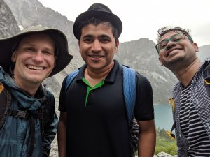

>## Hiking the Northern Cascades
**Dragontail Peak, Leavenworth, WA (August, 2019)**

I attended my first Rosetta Conference in Seattle in 2019, and one of the fun things is engaging with conference attendes in an informal post-conference activity. Here's a quick snap with my advisor Prof. Gray and Dr. Sudhanshu, on the Aasgard Pass, at ~5400 ft elevation gain, wet, exausted, yet mesmerized amidst the rocks of the Enchantments.

